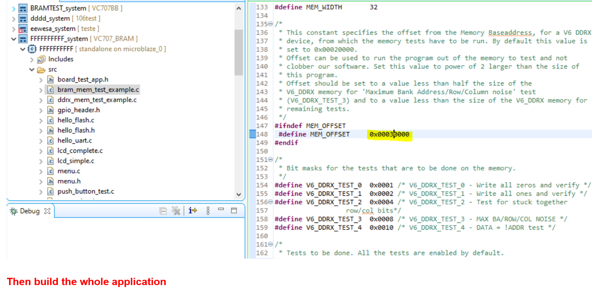

# VC707 BIST Flow
+ 此篇主要說明如何針對 VC707 進行周邊功能上的官方測試

**Last update: 2024/05/03**

+ Vivado Version: 2021.1

+ 該流程是參照 Vivado 2014.1 移植到 2021.1

+ 目錄下的 vc707_bist bd.tcl 為已經修改好 Vivado 版本至 2021.1，若須其他版本需自行更改

## Build VC707 BIST on Vivado

### 1. 開啟 Vivado ---> Create and Package New IP，並解壓下載好的 VC707 BIST 檔案

+ 可以直接下載該目錄下已經打包好的 vc707_bist

### 2. 選擇 Package a scpecified directory，並點選剛剛解壓後的 vc707/gtxe2_top_v1_00_a/hdl

### 3. Package IP 並建立 VC707 BIST Block Design

### 4. 選擇 MIG IP 於 Block Design 中，並修改 Clock 0 為 200 Mhz

### 5. 添加 Constraint File 於 Source 當中

### 6. Create HDL Wrapper 並 generate bitstream

### 7. Export XSA

## Build VC707 BIST Application on Vitis

### 8. 開啟 Vitis 並匯入 Vivado 導出的 XSA 建立 Platform

### 9. Build Platform

### 10. 建立 Application Project 於剛剛的 Platform 上

### 11. 從 vc707_bist/vc707_bist_sdk_bist_app_src 匯入程式檔案

### 12. 修改 xilflash_protection_example.c 中的 ReadBuffer, WriteBuffer 與 InterruptController 變數名稱

### 13. 修改 bram_mem_test_example.c 中的 MEM_OFFSET 的數值

### 14. Build 並執行 BIST 程式於 VC707 上

## APPENDIX A: Combine bitstream with .elf file(Only for MicroBlaze)

+ 可以將 Vitis Build 好的 Application .ELF 檔案與 Vivado 中的硬體設計進行連結，並重新產生具有 Vitis 已寫好 function 的 bitstream 供日後直接燒錄

+ Zynq 系列請直接於 Vitis 中產生 Boot Image 檔案（BOOT.bin）

