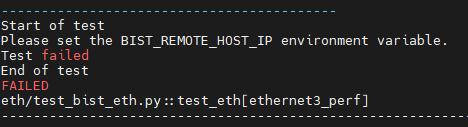
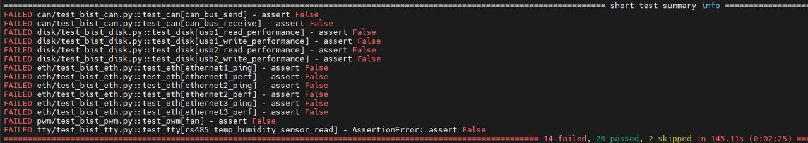

# Built-In Self Test Flow
+ 此篇主要說明如何針對KD240進行周邊功能上的官方測試

**Issue: 目前發現安裝 Kria-PYNQ 後仍無法成功執行 FOC 相關測試**

**Last update: 2024/02/29**

## Download Ubuntu 22.04
可以從此網址下載檔案
[Install Ubuntu on AMD | Ubuntu](https://ubuntu.com/download/amd)

​

## Setting Up the SD-Card Image 
使用 [balenaEtcher](https://etcher.balena.io/) 將剛剛下載的檔案燒錄到SD-Card內

也可以參考官方步驟來燒錄

[Setting up the SD Card Image (xilinx.com)](https://www.xilinx.com/products/som/kria/kd240-drives-starter-kit/kd240-getting-started/setting-up-the-sd-card-image.html)


依照下圖方式插入到 KD240 的 SD Card 槽中


## Power on KD240

依照下圖上電後開啟 [MobaXtern](https://mobaxterm.mobatek.net/download.html) 與 KD240 透過 UART 溝通


## Set Ubuntu environment and download Xilinx package
### 1. 登入帳號和密碼為
```
Account: ubuntu
Password: ubuntu
```

2. 接著依序輸入以下指令進行更新和 Xilinx Package 安裝
```
sudo apt update
sudo apt upgrade
sudo add-apt-repository ppa:xilinx-apps
sudo add-apt-repository ppa:ubuntu-xilinx/sdk
sudo apt update
sudo apt upgrade
sudo snap install xlnx-config --classic --channel=2.x
sudo apt search xlnx-firmware-kd240 ---> 尋找 BIST 的 firmware，也可以用 sudo apt search bist 尋找
sudo apt install xlnx-firmware-kd240-bist
```

3. 安裝 Kria-PYNQ
+ 安裝 Kria-PYNQ 會一併安裝 BIST 內關於 FOC Control 的 Dependencies
```
git clone https://github.com/Xilinx/Kria-PYNQ.git
cd Kria-PYNQ
sudo bash install.sh -b KD240
sudo reboot
```

## Load KD240 BIST firmware and Run the Test
1. 首先 unload 預先的 firmware 以及 load KD240 BIST firmware
```
sudo xmutil unloadapp
sudo xmutil loadapp kd240-bist
```

2. 安裝 Docker，並下載 Kria BIST 的 Docker Image
```
sudo apt-get install docker.io
sudo docker pull xilinx/kria-bist:2023.1
```

3. Docker 啟動
```
sudo docker run \
    --env=DISPLAY \
    --env=XDG_SESSION_TYPE \
    --net=host \
    --privileged \
    --volume=/home/ubuntu/.Xauthority:/root/.Xauthority:rw \
    -v /tmp:/tmp \
    -v /dev:/dev \
    -v /sys:/sys \
    -v /etc/vart.conf:/etc/vart.conf \
    -v /lib/firmware/xilinx:/lib/firmware/xilinx \
    -v /run:/run \
    -it xilinx/kria-bist:2023.1 bash 
```

4. 執行測試
```
cd /opt/xilinx/kria-bist/tests
pytest-3 --board kd240
```
測試的選項可以參照官方說明的細節

[Setting up the Board and Application Deployment — Kria™ KD240 1.0 documentation](https://xilinx.github.io/kria-apps-docs/kd240/build/html/docs/bist/docs/run.html)

5. 測試結果
+ 測試成功項目


+ 測試失敗項目


+ 測試總結


