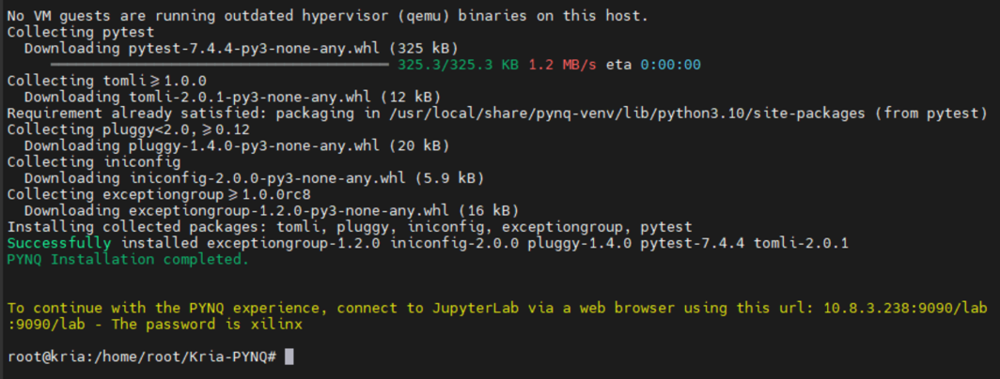
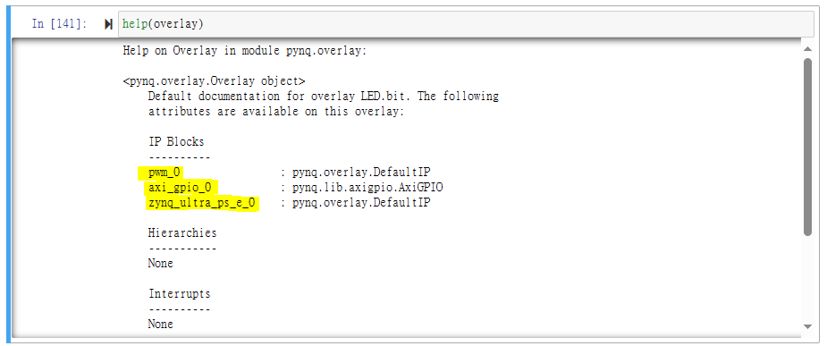
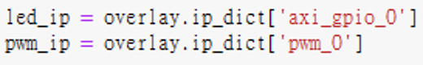
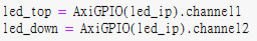
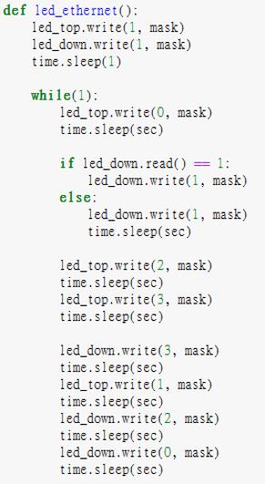
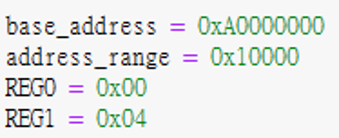
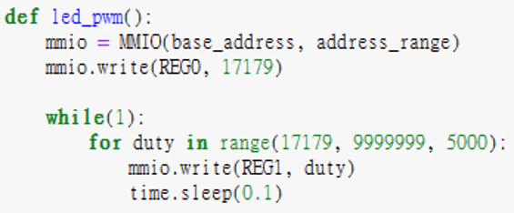
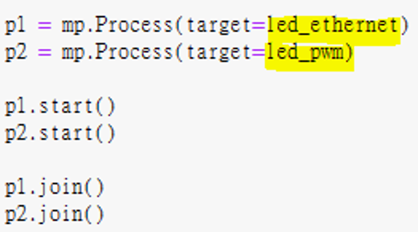

# KD240 PWM LED
+ 此篇主要說明如何在 KD240 上實現呼吸燈

**Last update: 2024/03/07**
- [x] **使用 Vivado & Vitis Design Flow 達成**
- [x] **使用 PYNQ Design Flow 達成**

## Vivado
## 自定義 PWM IP
+ Vivado 內部在頂端選單的 Tools 擁有新建及打包 IP 的選項，接下來此段落會介紹如何將 PWM IP 加入到 IP Catalog 中供日後使用
1. 於 Vivado 內選取 Create and Package New IP
​

2. 前面設定都直接點選 Next 即可


3. 設定 PWM IP，會開一個暫時的 project 來設定 IP


4. 加入 PWM RTL Code，Source Code－ax_pwm.v


5. 修改 AXI Top RTL Code 來引入剛剛的 PWM RTL Code
+ pwm_v1_0_S00_AXI.v


+ pwm_v1_0.v


+ 須注意 AXI Reset 是為 0 時 initial register value，這點要跟 PWM Code 一致


6. Merge Changes and Re-Package IP


## Create Block Design－開始於 Vivado 內的 Block Diagram 中將 IP 以 GUI 形式 import 進來
1. 呼叫 ZYNQ IP


2. 呼叫 PWM IP


3. 將 PWM IP 輸出 port 定義為外部接口


4. 透過 Vivado 的 Connection Automation 自動將 IP 透過 AXI Bus 連接在一起


5. 驗證設計，確定沒有問題


6. 添加 XDC 內容


XDC 內容可與 KD240 電路圖對照


## Generate Bitstream－產生燒錄檔並 Export 硬體資訊給 Vitis
1. Generate Bitstream，處理時間依電腦性能不同而有所差異


2. Export Hardware，會生成 .xsa 檔案提供 Vitis Import


3. 自定義 IP 要改 XSA 內容，透過 winrar 開啟 XSA 並點選以下路徑開啟 Makefile


4. 修改以下內容後儲存


## Vitis
## Create Platform and Application 
1. Create Platform 


2. Create 完要先 build 才會有 Library 連結檔案


3. Create Application 


4. 選擇剛剛建立好的 Platform


5. Next 直到選擇 Hello World 作為程式模板


6. 更改 KD240 BSP－因為 Kria Uart 預設為 1，但在 Vitis 內原始設定為 0


+ 其餘兩個檔案也要一起改成上述形式


7. 改完記得要重 Build


8. 開啟 helloworld.c，修改程式內容如下


## Modify KD240 Boot Behavior
+ 因為 Kria 系列預設是從 QSPI 開機，其次是 SD 卡，直接燒錄開機會有 Register 卡住問題，可以透過以下兩種方式解決
+ 修改 KD240 開機模式
1. 可以透過 TCL 修改開機模式
[Setting Bootmodes — Kria™ SOM 2022.1 documentation (xilinx.github.io)](https://xilinx.github.io/kria-apps-docs/creating_applications/2022.1/build/html/docs/bootmodes.html)


2. 建立好 TCL 檔之後，在 Vitis 的 xsct 內輸入以下
```
connect
source ./bootmode.tcl ---> 請按照自己放置 TCL 檔案的位置 cd 過去
boot_jtag
```


+ 修改 Run Configuration
1.


2. Use FSBL flow for initialization 不要打勾


## Program and Run Demo
Program 就成功了


## PYNQ
+ 這邊開始介紹如何透過 Python 控制在 Vivado 用 RTL Code 寫好的 IP
+ Python 控制 IP 的 function 需要參考 Vitis
+ 新增 PL Ethernet 端的 LED 燈閃爍，需要從 Vivado 端重新拉 GPIO LED 出來


1. 燒錄官方 Ubuntu Image 到 KD240 中，可參考 KD240 BIST 端的操作
+ Download Ubuntu 22.04 and put it in SDcard through balenaetcher
+ Boot Ubuntu 22.04 from KD240
+ sudo add-apt-repository ppa:xilinx-apps (Optional)
+ Update Ubuntu package
```
sudo apt update
sudo apt upgrade
```
+ Install Xilinx system management snap package ---> sudo snap install xlnx-config --classic (Optional)
+ Install Kria-PYNQ
```
git clone https://github.com/Xilinx/Kria-PYNQ.git
cd Kria-PYNQ
sudo bash install.sh -b KD240
```

2. 成功安裝後出現下圖，這時候在同網域下的瀏覽器輸入黃字部分的網址，即可開啟 Jupyter Lab


3. 建立一個名為 PWM_LED 的資料夾


3. 進入 PWM_LED 資料夾，將 Vivado 所產生的 .bit 以及 .hwh 都放進來，並創建一新 python 文件

+ .hwh 檔案位於 Vivado 的 .gen\sources_1\bd\design_1\hw_handoff 資料夾內


4. 進入 python 文件開始撰寫，以下介紹 Coding 流程與 API 用法，首先要 import python 與 pynq 的 library package 進來

```
from pynq import Overlay     ---> overlay 為 loading bitstream 時用到
from pynq.lib import AxiGPIO ---> AxiGPIO 針對設計內有用到 GPIO 的區塊可以進行 register 讀寫
import time                  ---> time 做為 delay 時間控制用
from pynq import MMIO        ---> MMIO 為 PS 控制 PL 端時讀寫 register 用，此篇則是以控制 PL PWM IP 為目的
import multiprocessing as mp ---> multiprocessing 可以執行多個迴圈同時運作
```

+ Overlay loading bitstream，注意一定會需要 .bit 和 .hwh


+ help(overlay) 可以查看當前 .bit 內用到什麼 IP，架構如何，以此與 Vivado 內的設計相呼應


+ 初始化 IP


+ 因 KD240 PL ethernet 上的 LED 有兩組，因此要額外再設定 channel (只有一組時也要設定 channel1)


+ 設定 GPIO direction，即 mask，0x0 為 input，0xf 為 output，並設定 LED 交互發光的 delay 數值 (秒為單位)


+ 撰寫 Ethernet LED 發亮動作時的 Function



```
PL ethernet 亮燈數值為
0: 亮右邊
1: 全不亮
2: 全亮
3: 亮左邊
```

+ 設定 PWM IP 的記憶體和 Register 數值


+ 這幾點實質可以參照 Vitis 以及 Vivado 內的 Address Editor


+ 撰寫 PWM IP Function，MMIO 會對記憶體位置去讀寫數值，基本上跟 Vitis 的邏輯概念一樣，可以照搬前面章節 Vitis C Code 改為 Python Code


+ 為了讓兩個迴圈同時動作，這邊利用 Multi-Process 將兩個 Function 加入到不同的 Process 中，並且同步運行


5. Demo 結果


## Reference
1. [【ZYNQ Ultrascale+ MPSOC FPGA教程】第三十章 自定义IP实验](https://www.cnblogs.com/alinx/p/14311827.html)
2. [Bootmodes — Kria™ SOM 2022.1 documentation](https://xilinx.github.io/kria-apps-docs/creating_applications/2022.1/build/html/docs/bootmodes.html)
3. [Development process and questions about KR260 standalone](https://support.xilinx.com/s/question/0D54U00005VTYUvSAP/development-process-and-questions-about-kr260-standalone?language=en_US)
4. [ug1093-kd240-starter-kit.pdf](https://docs.xilinx.com/viewer/book-attachment/Pkj1VOY1YOjY5KknJN14Tw/IxMAXzlNJgDQGeaYQ2ffUw)
5. [Loading an Overlay — Python productivity for Zynq (Pynq) v1.0](https://pynq.readthedocs.io/en/v2.3/pynq_overlays/loading_an_overlay.html)
6. [pynq.lib.axigpio Module — Python productivity for Zynq (Pynq) v1.0](https://pynq.readthedocs.io/en/v2.3/pynq_package/pynq.lib/pynq.lib.axigpio.html#pynq-lib-axigpio)
7. [pynq框架下自定义ip的使用_pynq ip](https://blog.csdn.net/quhai1340/article/details/113971309)


