# KD240 PWM LED
+ 此篇主要說明如何在 KD240 上實現呼吸燈

**Last update: 2024/03/07**
- [x] **使用 Vivado & Vitis Design Flow 達成**
- [x] **使用 PYNQ Design Flow 達成**

## Vivado
## 自定義 PWM IP
+ Vivado 內部在頂端選單的 Tools 擁有新建及打包 IP 的選項，接下來此段落會介紹如何將 PWM IP 加入到 IP Catalog 中供日後使用
1. 於 Vivado 內選取 Create and Package New IP
​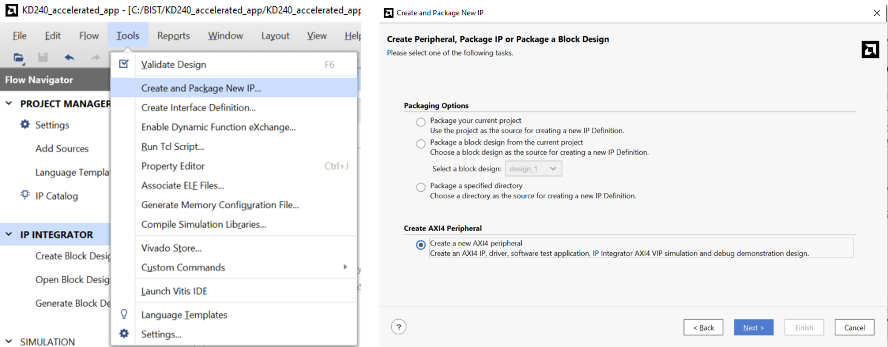

2. 前面設定都直接點選 Next 即可

3. 設定 PWM IP，會開一個暫時的 project 來設定 IP
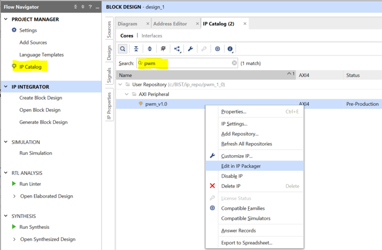

4. 加入 PWM RTL Code，Source Code－ax_pwm.v
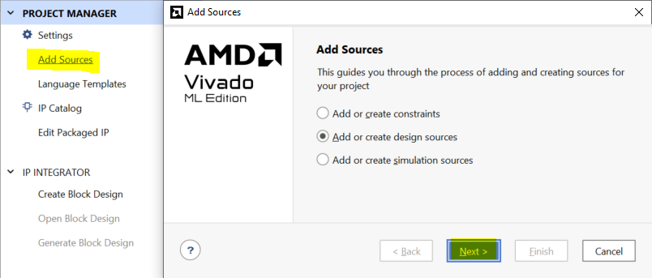
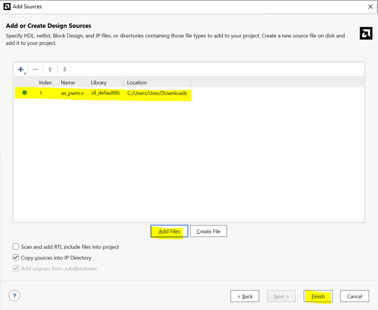

5. 修改 AXI Top RTL Code 來引入剛剛的 PWM RTL Code
+ pwm_v1_0_S00_AXI.v
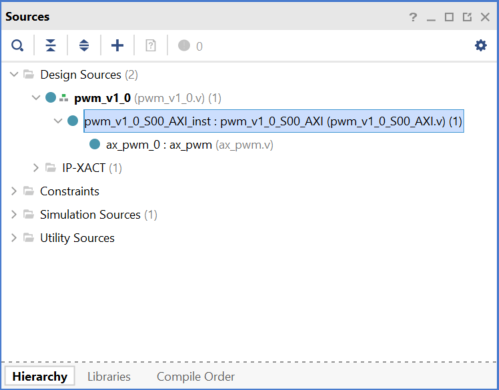

+ pwm_v1_0.v

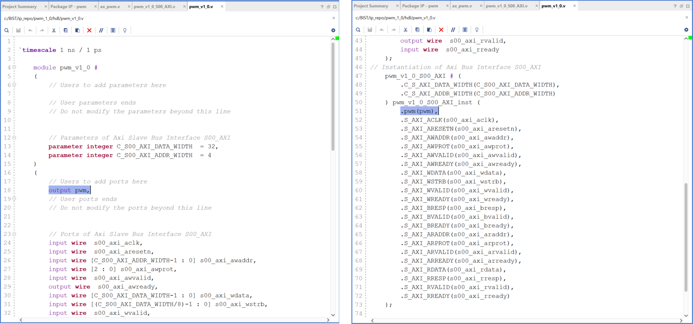

+ 須注意 AXI Reset 是為 0 時 initial register value，這點要跟 PWM Code 一致
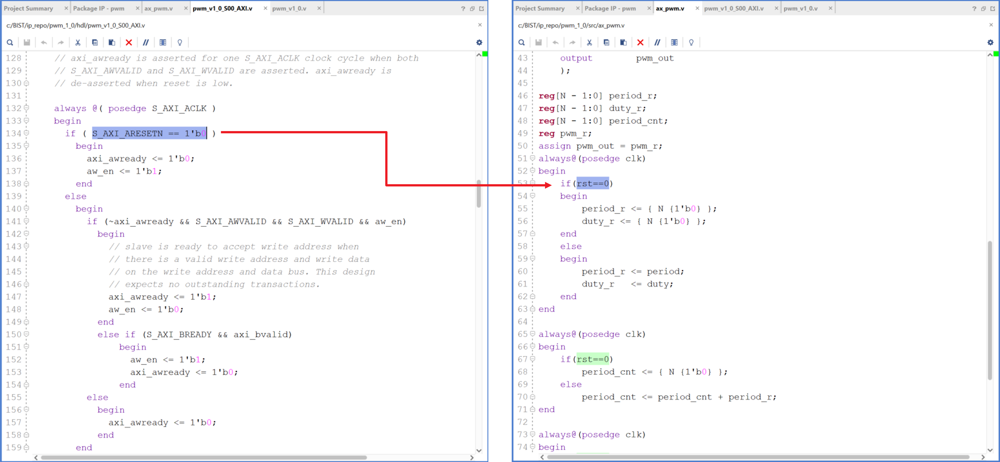

6. Merge Changes and Re-Package IP

## Create Block Design－開始於 Vivado 內的 Block Diagram 中將 IP 以 GUI 形式 import 進來
1. 呼叫 ZYNQ IP
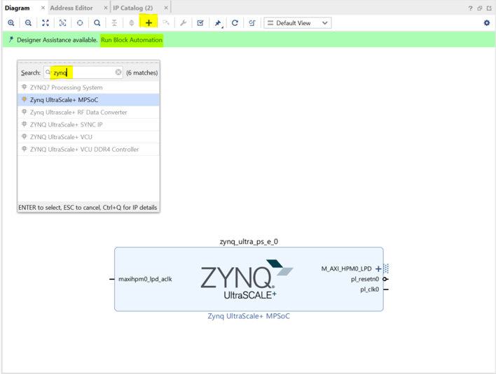

2. 呼叫 PWM IP

3. 將 PWM IP 輸出 port 定義為外部接口
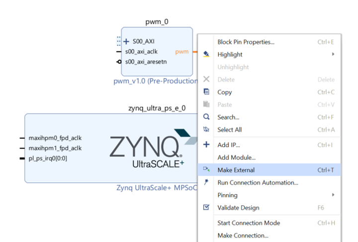

4. 透過 Vivado 的 Connection Automation 自動將 IP 透過 AXI Bus 連接在一起
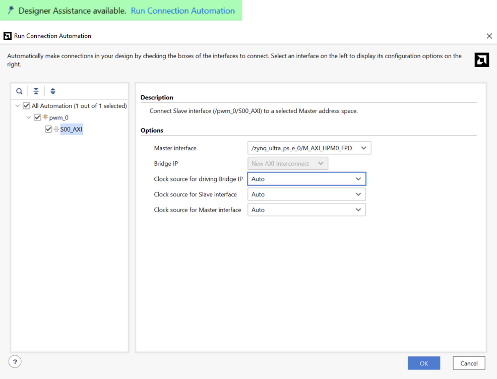

5. 驗證設計，確定沒有問題
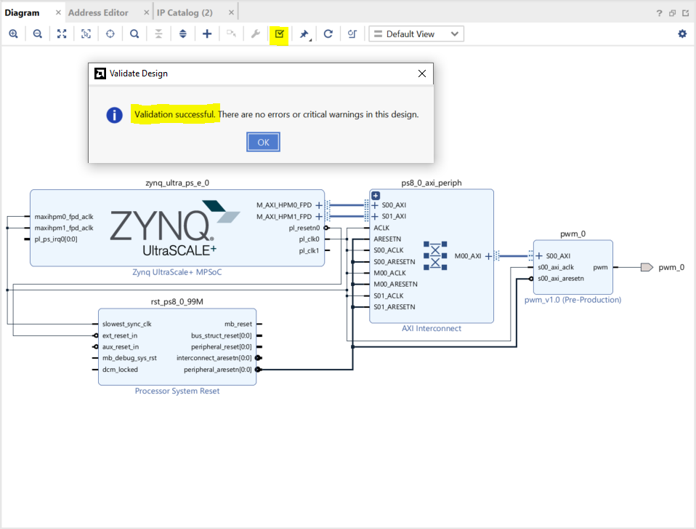

6. 添加 XDC 內容
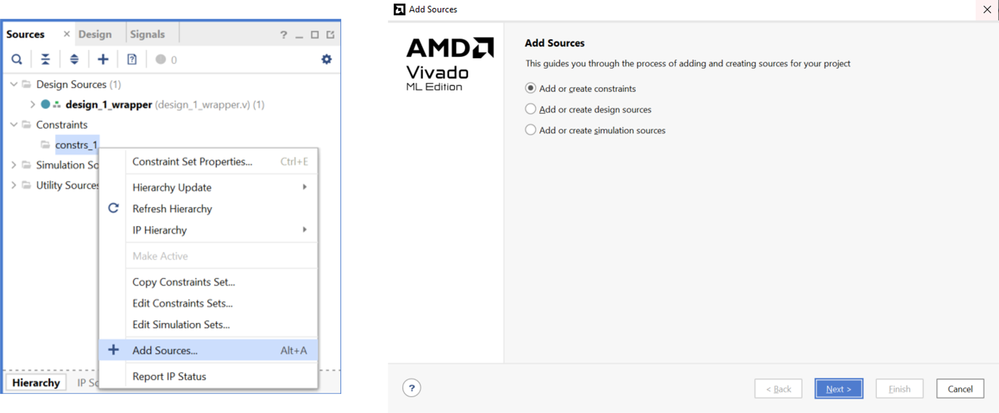

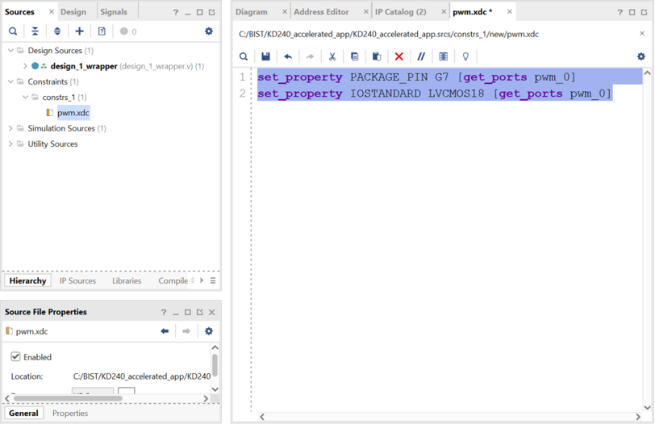

XDC 內容可與 KD240 電路圖對照
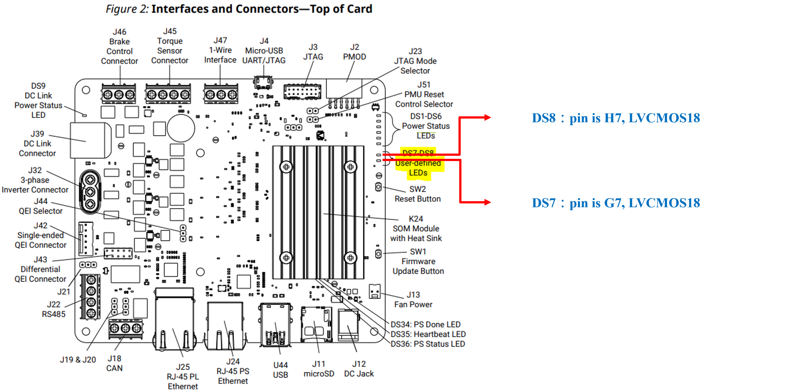

## Generate Bitstream－產生燒錄檔並 Export 硬體資訊給 Vitis
1. Generate Bitstream，處理時間依電腦性能不同而有所差異
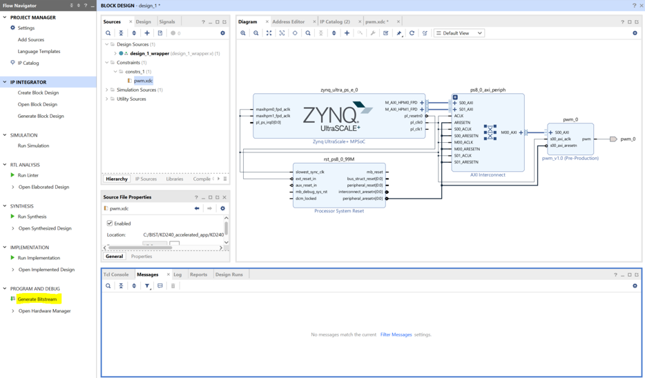

2. Export Hardware，會生成 .xsa 檔案提供 Vitis Import

3. 自定義 IP 要改 XSA 內容，透過 winrar 開啟 XSA 並點選以下路徑開啟 Makefile
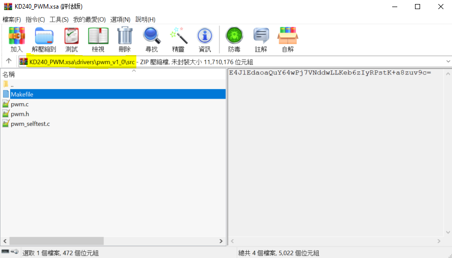

4. 修改以下內容後儲存
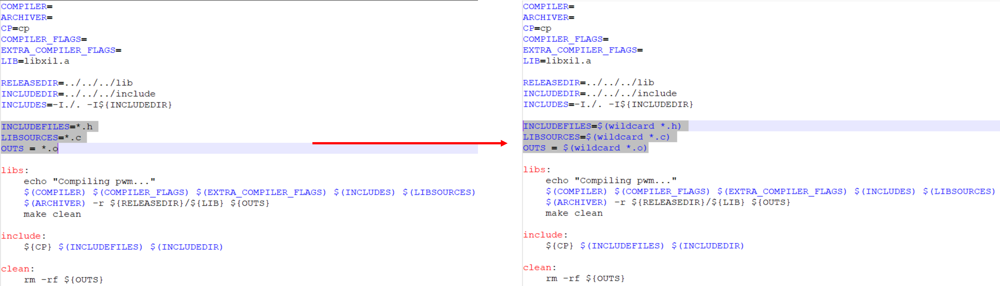

## Vitis
## Create Platform and Application 
1. Create Platform 

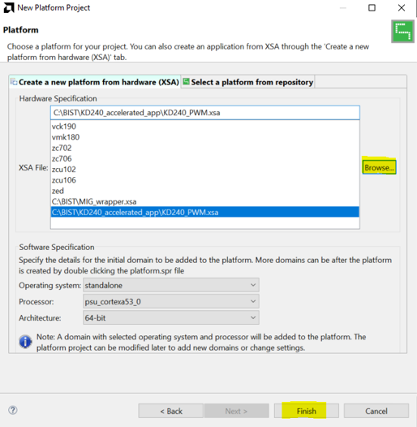

2. Create 完要先 build 才會有 Library 連結檔案
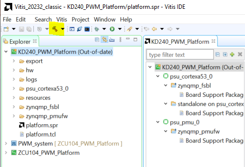

3. Create Application 
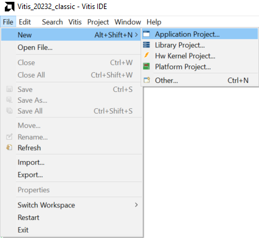

4. 選擇剛剛建立好的 Platform

5. Next 直到選擇 Hello World 作為程式模板

6. 更改 KD240 BSP－因為 Kria Uart 預設為 1，但在 Vitis 內原始設定為 0
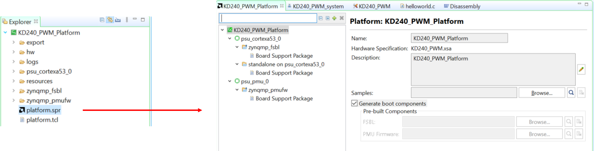

+ 其餘兩個檔案也要一起改成上述形式
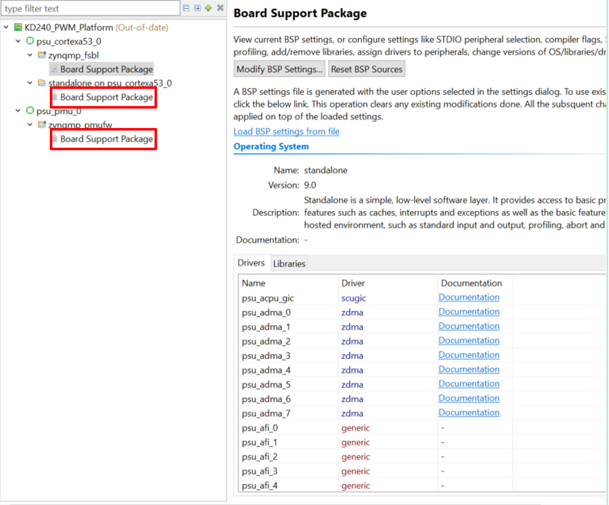

7. 改完記得要重 Build

8. 開啟 helloworld.c，修改程式內容如下
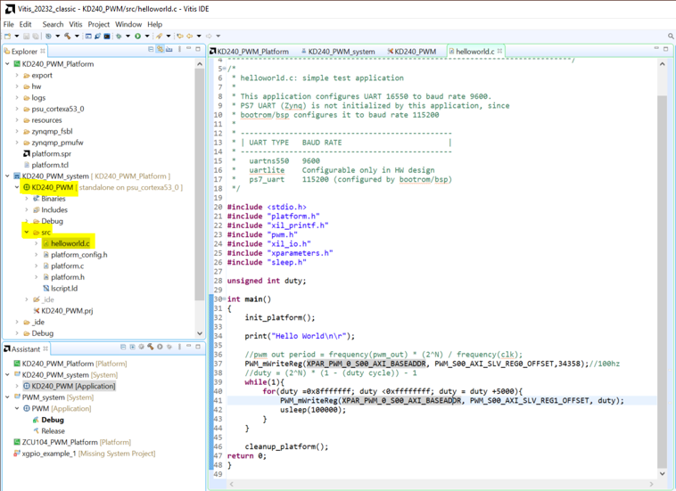

## Modify KD240 Boot Behavior
+ 因為 Kria 系列預設是從 QSPI 開機，其次是 SD 卡，直接燒錄開機會有 Register 卡住問題，可以透過以下兩種方式解決
+ 修改 KD240 開機模式
1. 可以透過 TCL 修改開機模式
[Setting Bootmodes — Kria™ SOM 2022.1 documentation (xilinx.github.io)](https://xilinx.github.io/kria-apps-docs/creating_applications/2022.1/build/html/docs/bootmodes.html)
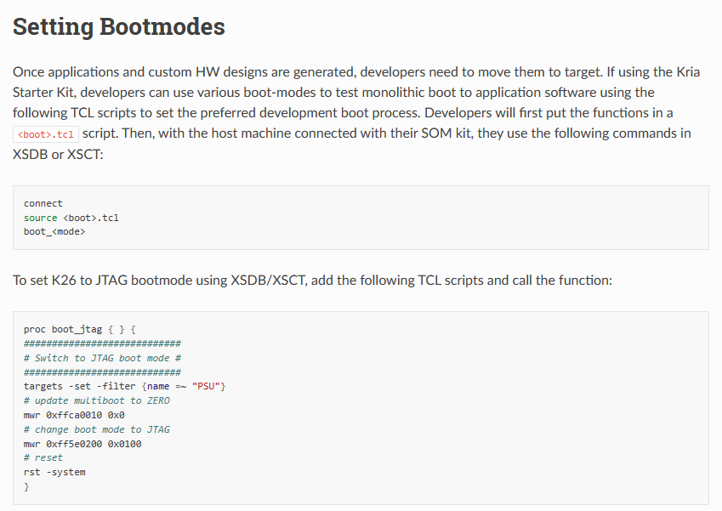

2. 建立好 TCL 檔之後，在 Vitis 的 xsct 內輸入以下

+ 修改 Run Configuration
1.
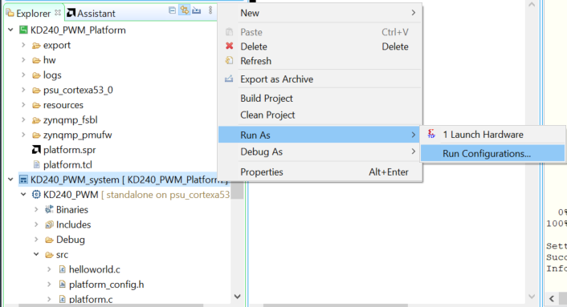

2. Use FSBL flow for initialization 不要打勾
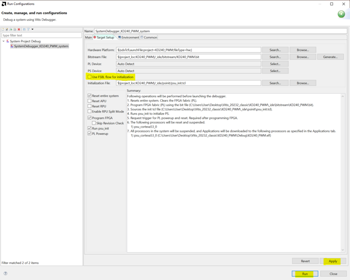

## Program and Run Demo
Program 就成功了

