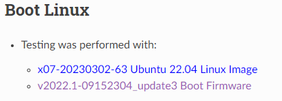
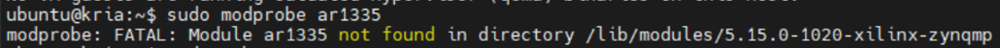
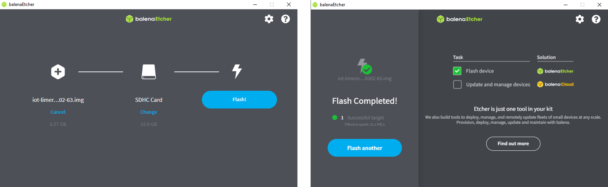
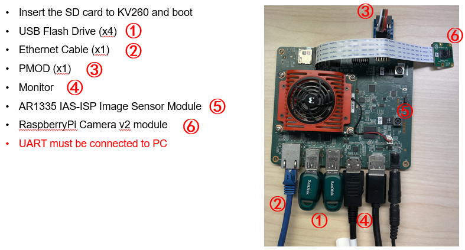
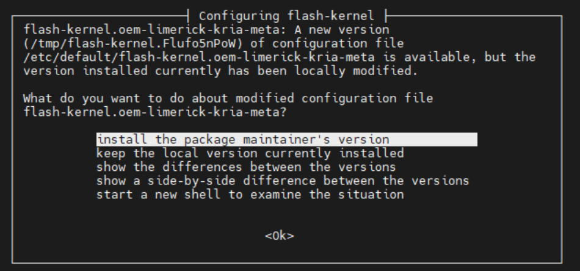
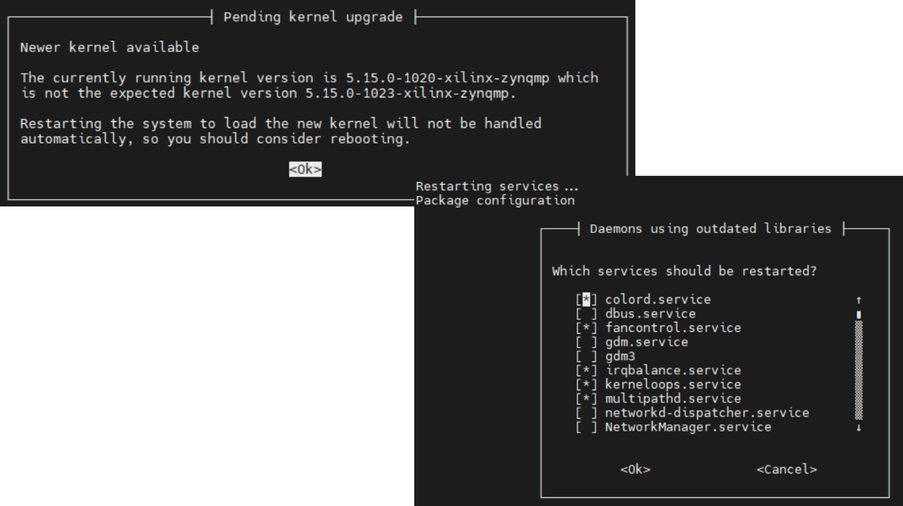
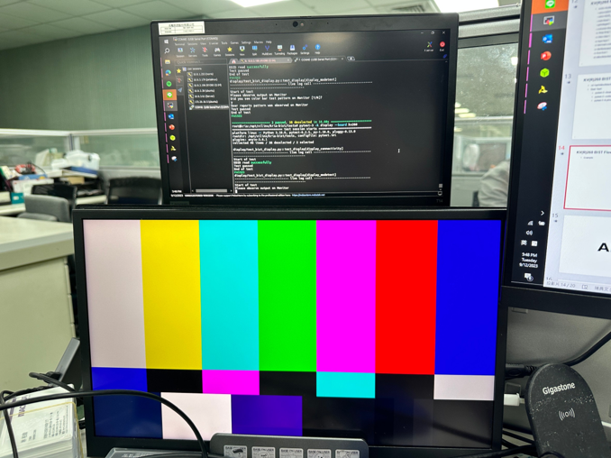
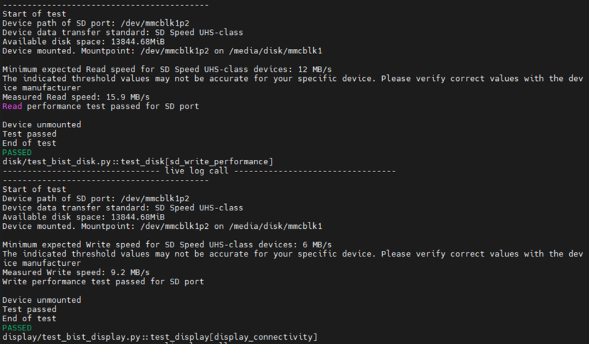
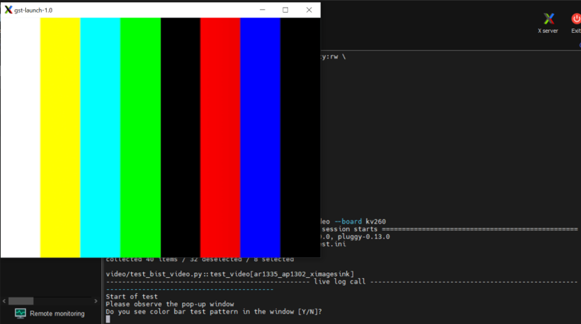
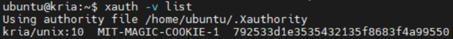

# KV(R)260 BIST Flow
+ 此篇主要說明如何針對 KV(R)260 進行周邊功能上的官方測試

**Last update: 2024/03/07**

+ Must be connected to Ethernet port!
+ Download the following files: including Ubuntu 22.04 and Boot Firmware

​

+ The minimum Linux kernel version required is 5.15.0.1022.26, or you will encounter the following error:

​

Module ar1335 not found 等於 mipi sensor not found

+ Program the Ubuntu 22.04 through balenaetcher



+ 設定 KV(R)260 周邊接的裝置



## Power on KV(R)260
+ Set Ubuntu environment and download Xilinx package
### 1. 登入帳號和密碼為
```
Account: ubuntu
Password: ubuntu
```

### 2. 接著依序輸入以下指令進行更新和 Xilinx Package 安裝
```
sudo apt update
sudo apt upgrade
sudo add-apt-repository ppa:xilinx-apps
sudo apt update
sudo apt upgrade
sudo snap install xlnx-config --classic
sudo apt search bist
sudo apt install xlnx-firmware-kv260-bist ---> 尋找 BIST 的 firmware
```

### 3. Update the flash kernel (KR260 may be different)



## Load KV(R)260 BIST firmware and Run the Test
### 1. 首先 unload 預先的 firmware 以及 load KV(R)260 BIST firmware
```
sudo reboot ---> to renew the latest kernel version
sudo xmutil listapps
sudo xmutil unloadapp
sudo xmutil loadapp kv260-bist
sudo modprobe ar1335 (KR260 has no ar1335)
```

### 2. 安裝 Docker，並下載 Kria BIST 的 Docker Image
```
sudo apt-get install docker.io
sudo docker pull xilinx/kria-bist:2022.2

sudo xmutil desktop_disable
sudo systemctl stop fancontrol
```

### 3. Docker 啟動
```
sudo docker run \
    --env=DISPLAY \
    --env=XDG_SESSION_TYPE \
    --net=host \
    --privileged \
    --volume=/home/ubuntu/.Xauthority:/root/.Xauthority:rw \
    -v /tmp:/tmp \
    -v /dev:/dev \
    -v /sys:/sys \
    -v /etc/vart.conf:/etc/vart.conf \
    -v /lib/firmware/xilinx:/lib/firmware/xilinx \
    -v /run:/run \
    -it xilinx/kria-bist:2022.2 bash 
```

### 4. 執行測試
```
cd /opt/xilinx/kria-bist/tests
pytest-3 --board kv260 ---> Run the entire BIST test suite for a target board
```

+ 可以個別測試項目，例如
```
pytest-3 -k display --board kv260
```


測試的選項可以參照官方說明的細節
[Setting up the Board and Application Deployment — Kria™ KV260 2022.1 documentation](https://xilinx.github.io/kria-apps-docs/kv260/2022.1/build/html/docs/bist/docs/run.html)

### 5. 測試結果
+ 測試成功項目



## 附錄
### 1. Temporary failure in name resolution Error
[Ubuntu 20.04 server不能ping，提示“Temporary failure in name resolution”的解决方法](https://blog.csdn.net/donaldsy/article/details/119973990)
```
sudo systemctl restart systemd-resolved.service ---> this command will solve this problem
```

### 2. Install v2022.1-09152304_update3 Boot Firmware
```
sudo xmutil bootfw_update -i <path to boot.bin>
```

### 3. Unsupported authorisation protocol

```
xauth -v list ---> Using authority file /home/ubuntu/.Xauthority
```

If incorrect or no authority file present, do the following steps:

```
rm -rf ~/.Xaut*
sudo reboot
```




