# ZCU104(MPSoC) System Monitor Usage with Vitis
+ 此篇主要說明如何在 MPSoC 上利用 System Monitor 查看 Chip 溫度與各項電壓資訊

**Last update: 2024/05/08**

**Vivado & Vitis Version is 2023.2**

## Vivado Part

### 1. (前略)開啟 Block Design，調用 ZYNQ MPSoC IP 就好，我們要使用 PS 端而已

​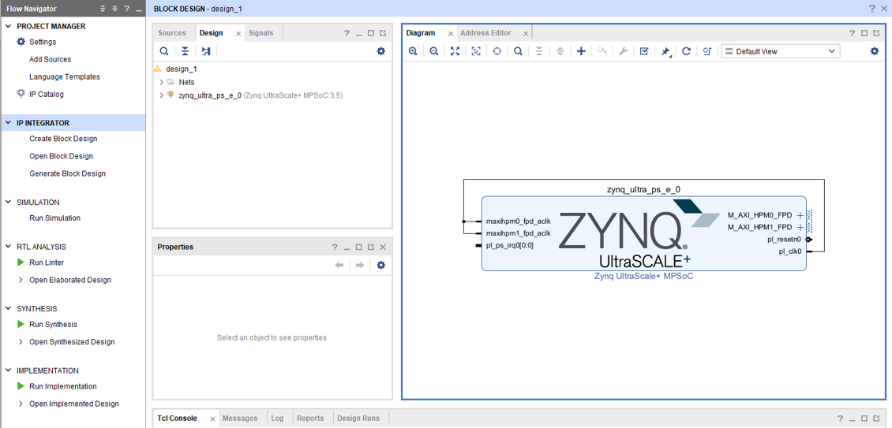

### 2. Create HDL Wrapper and Generate Bitstream

​

### 3. Export XSA for Vitis

​

## Vitis Part

### 1. 建立 Platform

​

### 2. Build Platform

​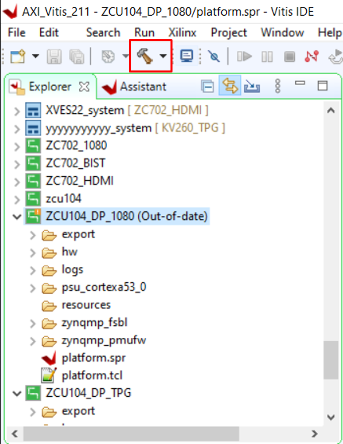

### 3. 點選 platform.spr 並找到右方的 Board Support Package，並選擇底下 psu_ams 來 import example code

​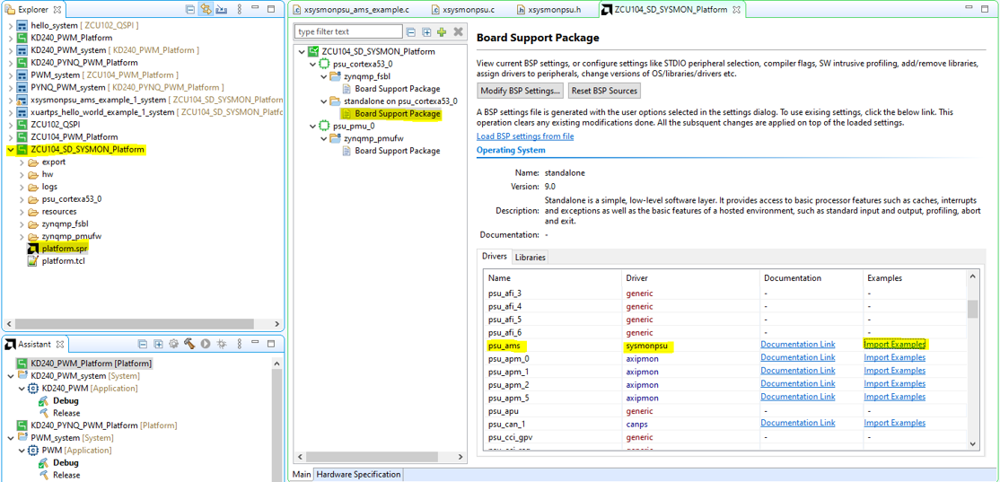

​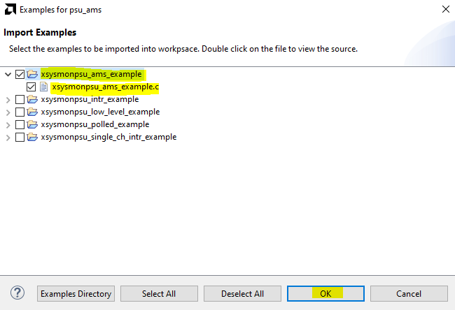

### 4. 主要修改 SysMonPsuAMSExample 這個 Function 

​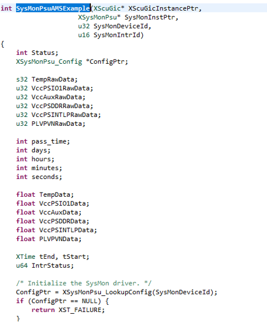

### 4. 當然跟使用一般 IP 一樣，要先 instance SysMon，Configure SysMon，Get SysMon DeviceID 等等 

​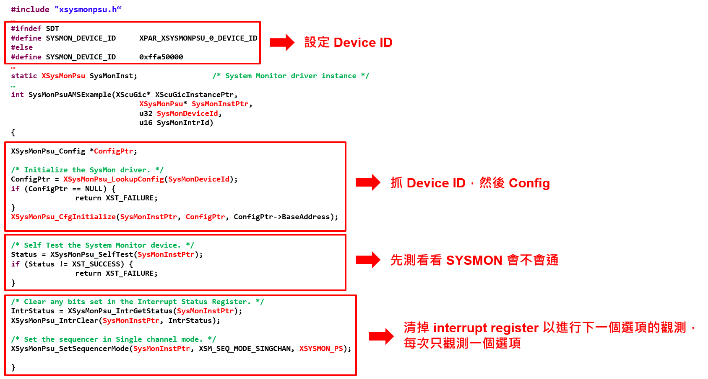

### 5. 以 VCC_PSBATT 為例

​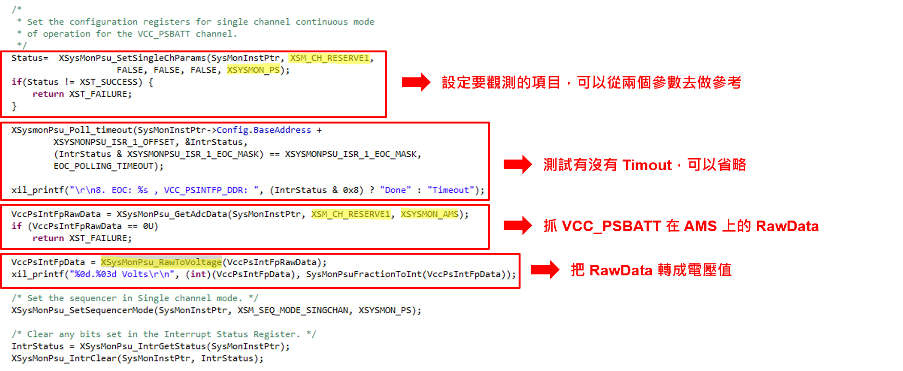

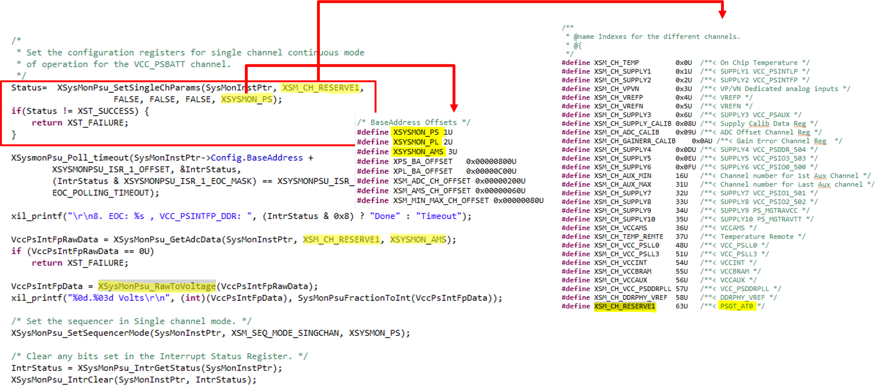

### 6. 以溫度為例

​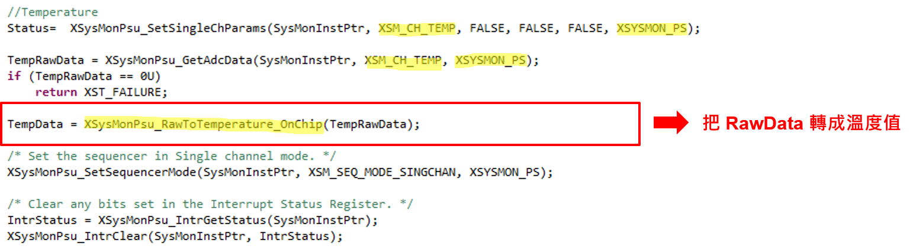

### 7. 可以透過以上流程和 example code，將自己想要觀測的照參數填寫進去，最後再 xil_printf 出來

​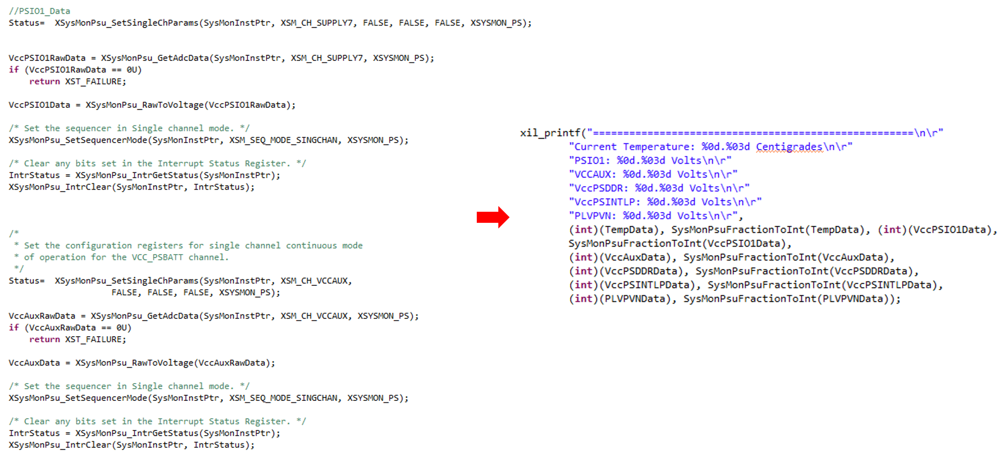

### 8. 寫法二－上述寫法在長時間執行會有 Crash 現象發生

​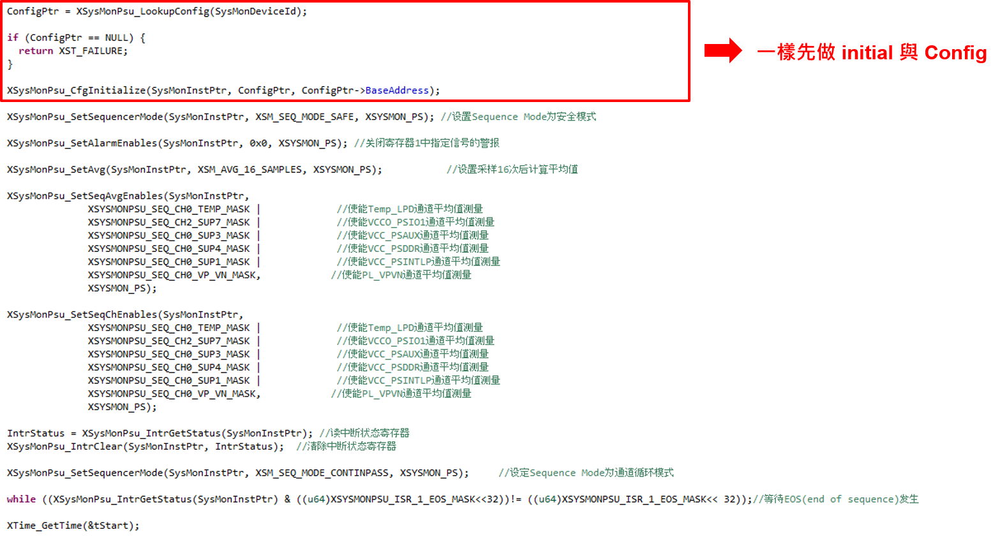

### 9. Result - 有加上運行時間顯示，使用 XTime_GetTime

​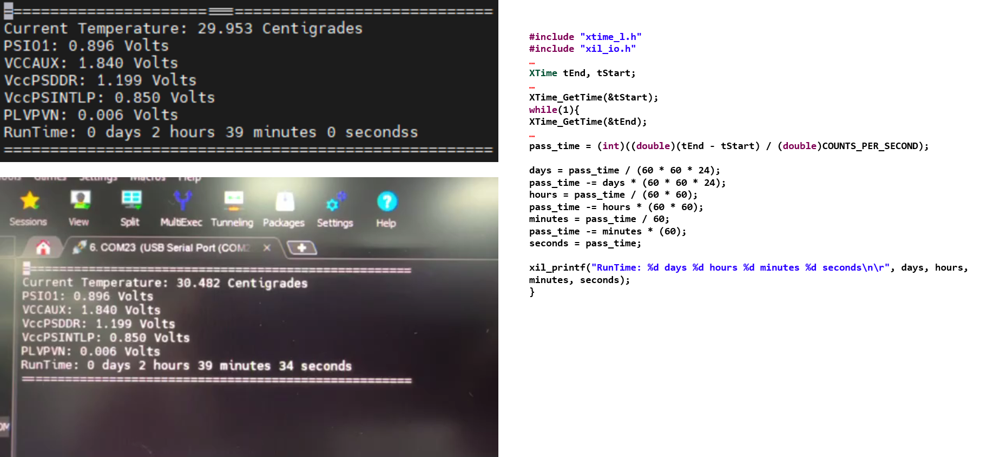

## APPENDIX: xil_printf vs printf

+ 可以參考以下這兩篇，簡單來說 xil_printf 不支援 float

[Which printf or xil_print?](https://support.xilinx.com/s/question/0D52E00006iHje3SAC/which-printf-or-xilprint?language=en_US)

[UG643 page 10.](https://docs.xilinx.com/viewer/book-attachment/5nHLTKfkxP0ydpQtwymDhw/EGwdjUfoOM563Ied6W9UnA)

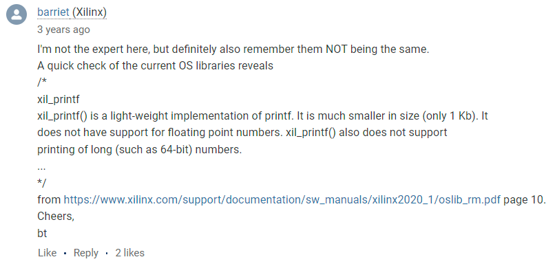

