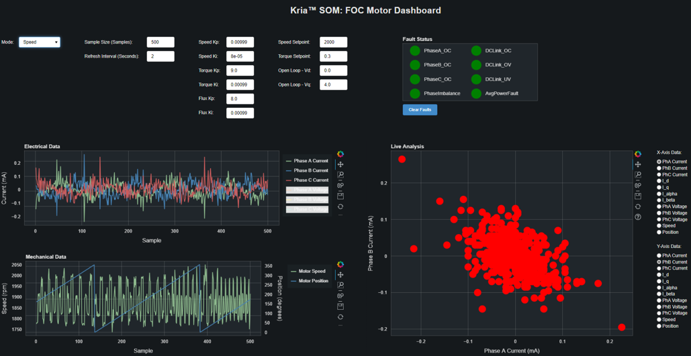

# KD240 FOC Control Demo
+ 此篇主要說明如何針對 KD240 與搭配的 FOC 配件進行 Demo

**Last update: 2024/03/07**
- [x] **Issue: 發現沒有安裝 Kria-PYNQ 會無法成功執行 Demo，已解決**

## Download Ubuntu 22.04
可以從此網址下載檔案
[Install Ubuntu on AMD | Ubuntu](https://ubuntu.com/download/amd)

​

## Setting Up the SD-Card Image 
使用 [balenaEtcher](https://etcher.balena.io/) 將剛剛下載的檔案燒錄到 SD-Card 內

也可以參考官方步驟來燒錄

[Setting up the SD Card Image (xilinx.com)](https://www.xilinx.com/products/som/kria/kd240-drives-starter-kit/kd240-getting-started/setting-up-the-sd-card-image.html)


依照下圖方式插入到 KD240 的 SD Card 槽中


## Power on KD240

依照下圖上電後開啟 [MobaXtern](https://mobaxterm.mobatek.net/download.html) 與 KD240 透過 UART 溝通


## Set Ubuntu environment and download Xilinx package
### 1. 登入帳號和密碼為
```
Account: ubuntu
Password: ubuntu
```

### 2. 接著依序輸入以下指令進行更新和 Xilinx Package 安裝
```
sudo apt update
sudo apt upgrade
sudo add-apt-repository ppa:xilinx-apps
sudo add-apt-repository ppa:ubuntu-xilinx/sdk
sudo apt update
sudo apt upgrade
sudo snap install xlnx-config --classic --channel=2.x
sudo apt search xlnx-firmware-kd240 ---> 尋找 FOC 的 firmware
sudo apt install xlnx-firmware-kd240-motor-ctrl-qei
```

### 3. 安裝 Kria-PYNQ
+ 安裝 Kria-PYNQ 會一併安裝關於 FOC Control 的 Dependencies
```
git clone https://github.com/Xilinx/Kria-PYNQ.git
cd Kria-PYNQ
sudo bash install.sh -b KD240
sudo reboot
```

### 4. 安裝其餘 Dependencies 與 FOC Control App
```
sudo apt install cmake python3-dev python3-pybind11 libiio-dev
git clone https://github.com/Xilinx/foc-motor-ctrl.git
cd foc-motor-ctrl
mkdir -p build
cd build/
cmake -DCMAKE_INSTALL_PREFIX=/opt/xilinx/xlnx-app-kd240-foc-motor-ctrl -DBUILD_DASHBOARD_APP=ON ..
make
sudo make install
sudo apt install libiio-utils libiio0 python3-pybind11 python3-bokeh=2.4.3-0ubuntu1
```

## Run KD240 FOC COntrol Demo
```
cd /opt/xilinx/xlnx-app-kd240-foc-motor-ctr/bin
./start_motor_dashboard
```

### 測試結果



## Reference
1. [FOC Motor Control App](https://github.com/Xilinx/foc-motor-ctrl)


