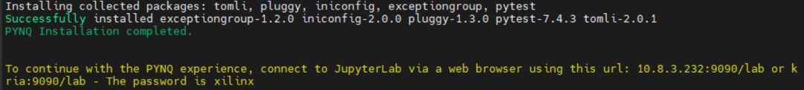
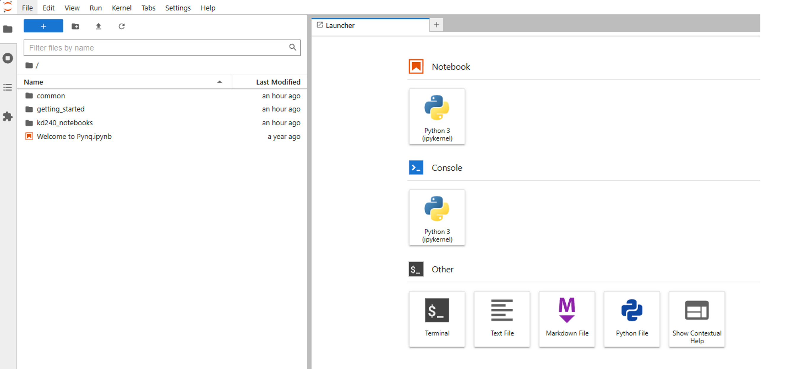
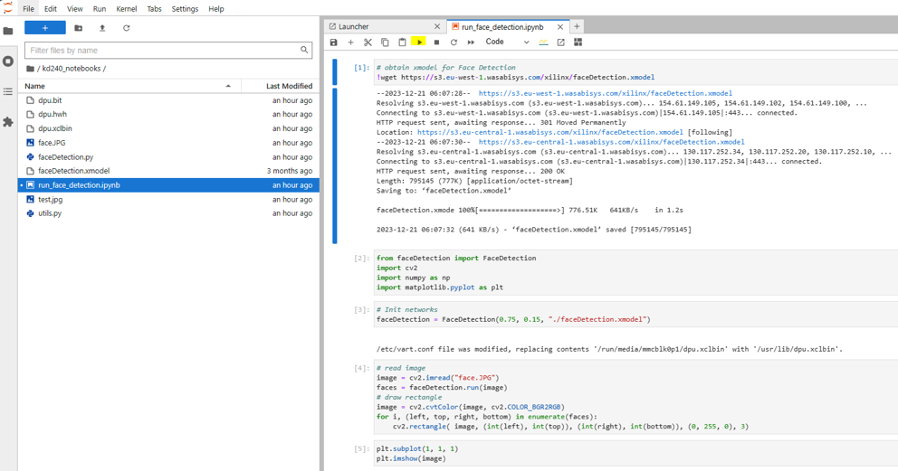
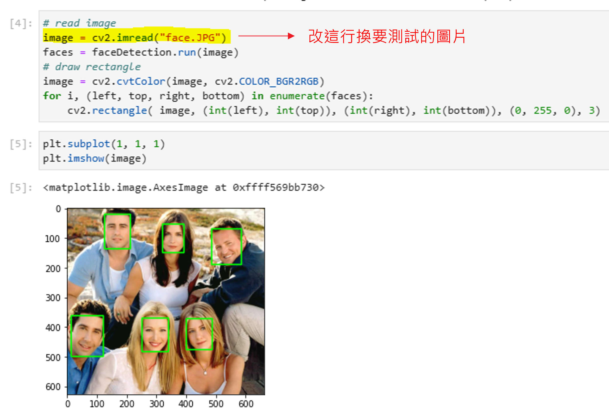

# KD240 Face Detect
+ 此篇主要說明如何針對 KD240 進行 AI 辨識（Face Detect）

**Last update: 2024/03/07**

## Download Ubuntu 22.04
可以從此網址下載檔案
[Install Ubuntu on AMD | Ubuntu](https://ubuntu.com/download/amd)

​

## Setting Up the SD-Card Image 
使用 [balenaEtcher](https://etcher.balena.io/) 將剛剛下載的檔案燒錄到SD-Card內

也可以參考官方步驟來燒錄

[Setting up the SD Card Image (xilinx.com)](https://www.xilinx.com/products/som/kria/kd240-drives-starter-kit/kd240-getting-started/setting-up-the-sd-card-image.html)


依照下圖方式插入到 KD240 的 SD Card 槽中


## Power on KD240

依照下圖上電後開啟 [MobaXtern](https://mobaxterm.mobatek.net/download.html) 與 KD240 透過 UART 溝通


## Set Ubuntu environment and download Xilinx package
### 1. 登入帳號和密碼為
```
Account: ubuntu
Password: ubuntu
```

### 2. 接著依序輸入以下指令進行更新和 Kria-PYNQ 安裝
```
sudo apt update
sudo apt upgrade
git clone https://github.com/Xilinx/Kria-PYNQ.git
cd Kria-PYNQ
~~更改 install.sh 242 行 ---> cp -r pynq_dpu/kd240_notebooks /root/jupyter_notebooks/ (原廠已修復該問題)~~
sudo bash install.sh -b KD240
sudo reboot
```
+ 安裝結束且成功後會看到以下訊息


## Start Demo
### 1. 輸入黃字給予的網址 e.g., 10.8.3.232:9090/lab，並輸入密碼：xilinx 後會看到以下畫面


### 2. 點選 kd240_notebooks
+ 進入 run_face_detection.ipynb 可以發現該檔案會呼叫 faceDetection.py，並且 faceDetection.py 會再 import utils.py 進來
+ 在 run_face_detection.ipynb 中點選黃色撥放鍵逐一執行程式


### 結果
+ 結果會顯示在畫面上，並且可以自己抓圖片來做測試

