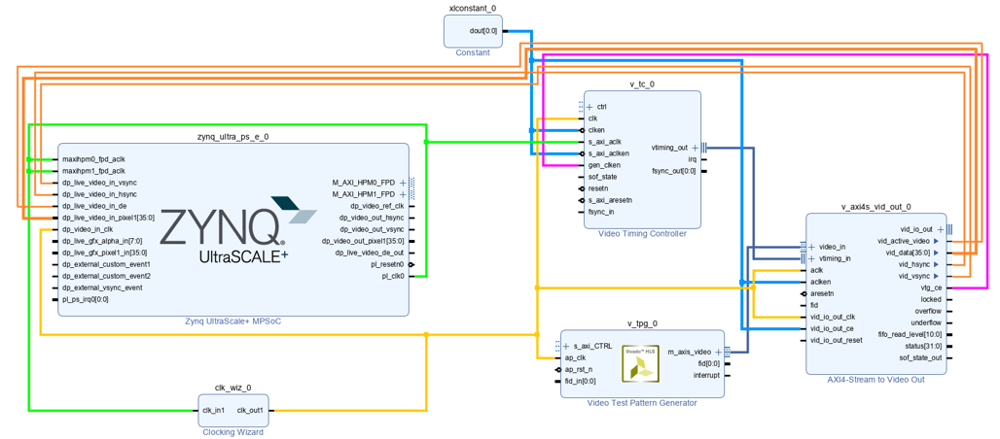
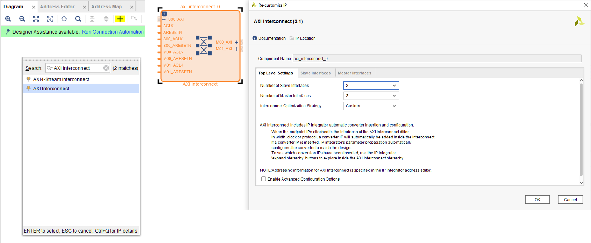

# ZCU104(MPSoC) DP TPG Output Example
+ 此篇主要說明如何針對 ZCU104 透過 PS 端的 Display Port 來輸出 TPG 的畫面
+ PS 端的 Display Port 只支援到 4K@30HZ

**Last update: 2024/05/15**

+ Vivado Version: 2021.1

## Build ZCU104 Block Design on Vivado

### 1. 針對每個 IP 進行設置並連接

+ Zynq MPSoC PS 

+ Video Test Pattern Generator

+ AXI4-Stream to Video Out

+ Video Timing Controller

+ Clocking Wizard

+ 將以上 IP 開始進行連接

+ 新增 AXI Interconnect IP

Run Connection Automation

### 2. Create HDL Wrapper & Generate Bitstream

### 4. Export Hardware，這步會輸出 XSA 到 Vitis 中做 C Code 的撰寫來控制 FPGA

## Build ZCU104 Application on Vitis

### 5. 打開 Vitis，匯入 XSA 建立 Platform

+ Platform 建立後要進行 Build 以產生連結檔

### 6. 這邊要開兩個 Application，一個是 Hello World，一個是 dpdma 的 example code

### 7. 到 Hello Word 的專案下，匯入 dpdma example code

### 8. 開啟 xdpdma_video_example.c 和 xdpdma_video_example.h 更改 code

+ 因為是 1920x1080，記得修改一下 code 如下

+ Build & Run

### 9. 右鍵 Application 並選擇 Run as 1 Launch Hardware，查看結果

## Reference

+ [4K TPG Video Streaming in Kria KV260](https://www.hackster.io/nikilthapa/4k-tpg-video-streaming-in-kria-kv260-baremetal-part-1-c0c9d6)

+ [MicroZed Chronicles: DisplayPort Controller ](https://www.hackster.io/news/microzed-chronicles-displayport-controller-part-one-25734db13fad)

+ [Ultra96V2_DisplayPort](https://github.com/ATaylorCEngFIET/Ultra96V2_DisplayPort/tree/master/display_port/display_port.sdk/dispport/src)

