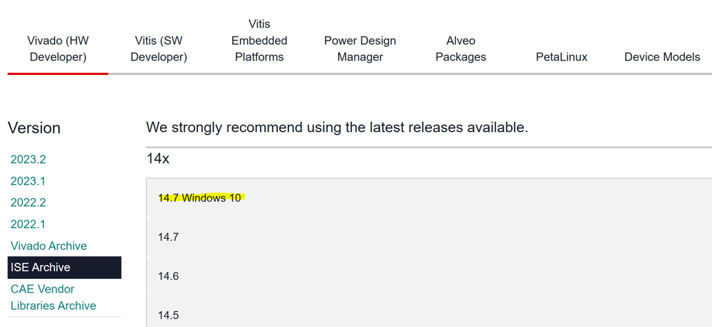
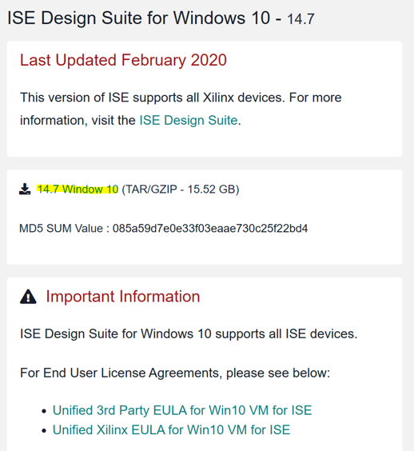
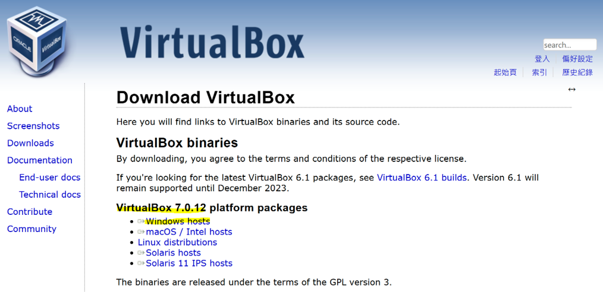
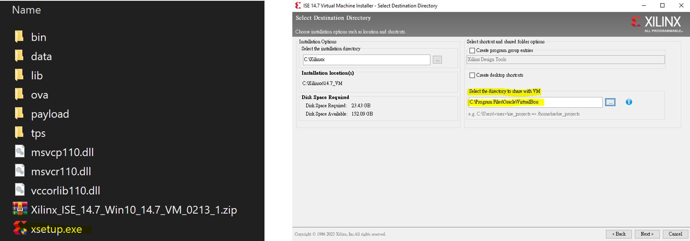
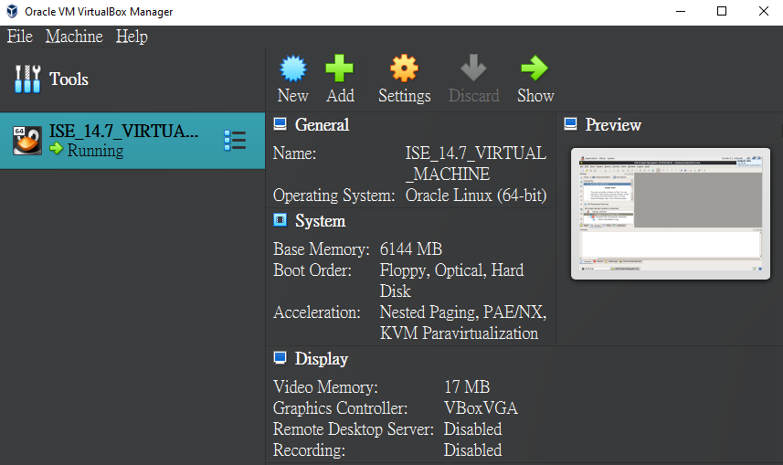
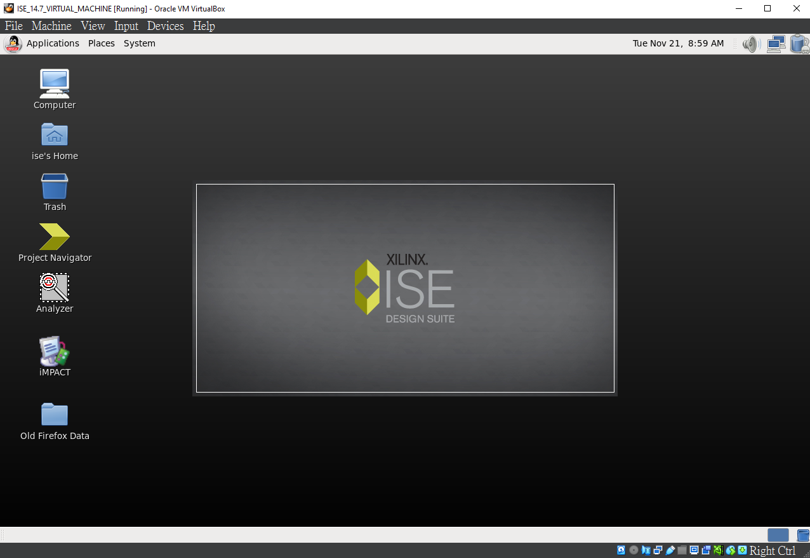
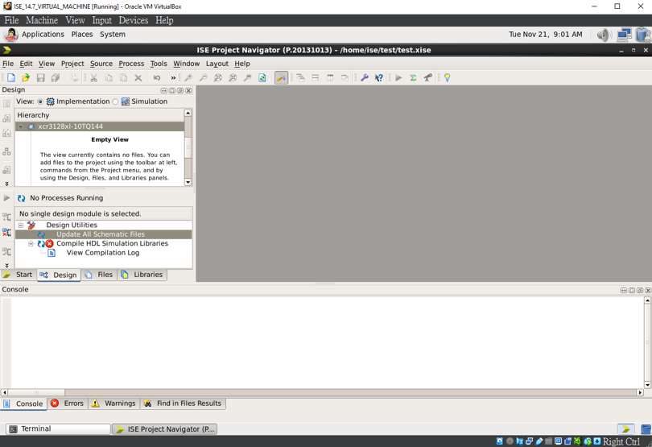
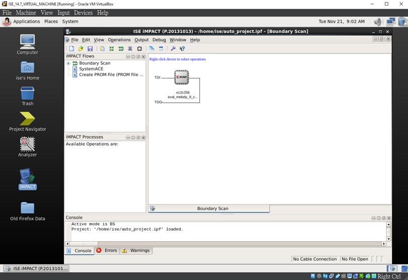

# Install ISE on WIN10
+ 鑒於 ISE 適用於 Xilinx 早期 CPLD 以及 6-Series 的產品，以往已不直接支持 WIN10 系統，但可以透過本篇方式在 WIN10 上建構 ISE 開發環境

**Last update: 2024/05/08**

## Download ISE 14.7 Windows 10

可以從此網址下載檔案 [ISE 14.7](https://www.xilinx.com/support/download/index.html/content/xilinx/en/downloadNav/vivado-design-tools/archive-ise.html)

​

​

## Download VitualBox (Not VMWare) 

可以從此網址下載檔案 [Oracle VM VirtualBox](https://www.virtualbox.org/wiki/Downloads)

## 開始安裝 ISE

安裝結束後開啟 Virtual Box，可以發現已有 ISE 鏡像檔

點兩下開啟，可以看到 ISE 專屬環境已經建構完成

## Open ISE

ISE Project Navigator

iMPACT - 作為燒錄使用

