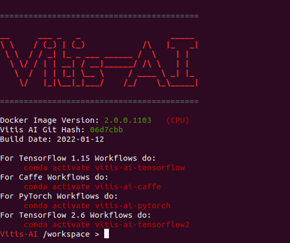
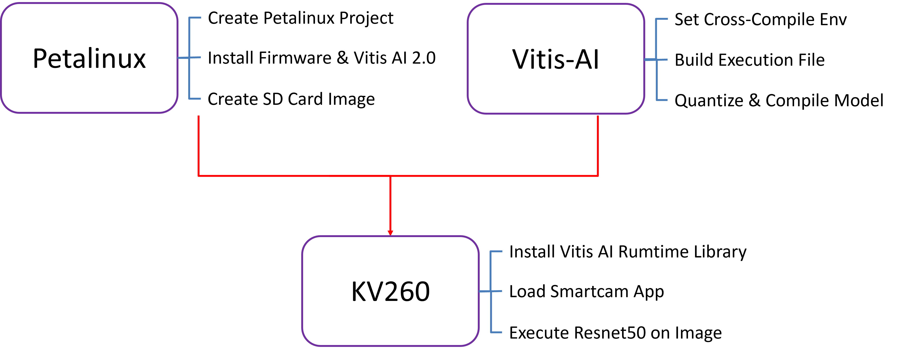
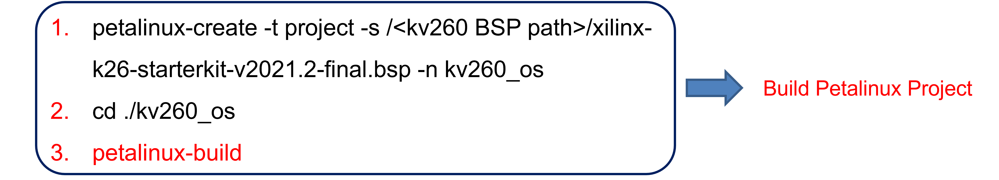
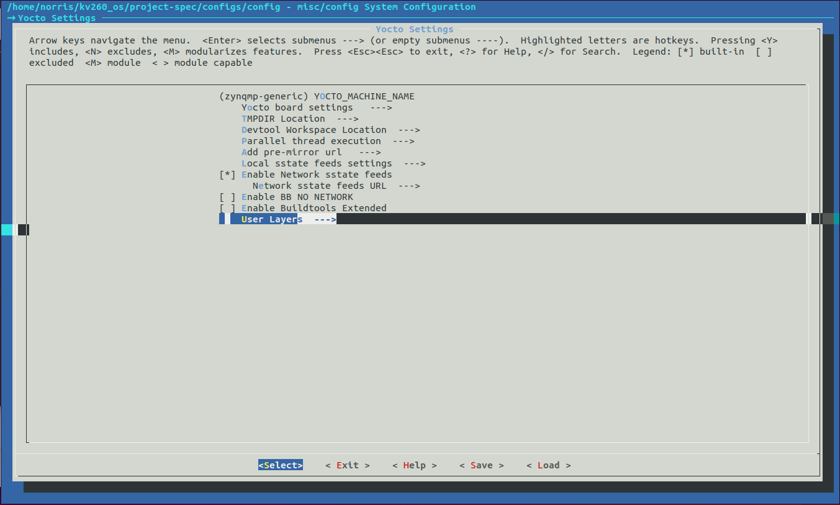

# Vitis AI Lab
+ 此篇主要介紹官方對於 Vitis AI 提出的六個 Lab

**Last update: 2024/03/14**

## Environment Setup
### 1. 可以安裝 VMware 或是在獨立電腦上安裝 Ubuntu 20.04
 
### 2. 安裝 Docker

+ Install Docker
```
sudo apt-get install docker.io
```

+ Check Docker installation
```
sudo docker --version
```

+ Remove typing ‘sudo’ before docker
```
sudo chmod 666 /var/run/docker.sock
```

### 3. 安裝 Vitis AI 2.0

+ Download Vitis AI v2.0 from github
```
git clone https://github.com/Xilinx/Vitis-AI.git -b v2.0
```

+ Download Vitis AI Docker Image
```
docker pull xilinx/vitis-ai:2.0.0
```

+ Activate Vitis AI Docker Environment
```
./docker_run.sh 2.0.0
```



## Lab 1: AI Quantizer and AI Compiler – Caffe

check the tutorial on “AI Quantizer and AI Compiler – Caffe.docx”

### Result


## Lab 2: AI Quantizer and AI Compiler – TensorFlow2 and PyTorch

check the tutorial on “AI Quantizer and AI Compiler – TensorFlow2 and PyTorch”

### Result


## Lab 3: Vitis AI Library (VART) – Using KV260

### 分成以下幾個步驟
+ 1. Ubuntu 18.04 (PC)
+ 2. PetaLinux Tools - Installer - 2021.2
+ 3. Kria K26 SOM Board Support Package - 2021.2
+ 4. Vitis-AI Lab 2.0

2, 3, 4 會在 PC 端上的 Ubuntu 18.04 進行 building，各自負責的功能會如下圖



### Petalinux Building


```
Dowload Petalinux Tools – Installer (2021.2)
Install Dependencies (petalinux document will provide)
./petalinux-v2021.2-final-installer.run -d <custom path>
source <custom path>/settings.sh
```



```
petalinux-create -t project -s /<kv260 BSP path>/xilinx-k26-starterkit-v2021.2-final.bsp -n kv260_os
cd ./kv260_os
petalinux-build
```

Add Vitis AI 2.0 & Firmware to Petalinux
```
cd components/yocto/layers/
sudo rm -r meta-vitis-ai
git clone -b rel-v2021.2 https://github.com/jlamperez/meta-vitis-ai.git meta-vitis-ai
vi ~/kv260_os/build/conf/bblayers.conf
delete ${SDKBASEMETAPATH}/layers/meta-vitis-ai
add new meta-vitis-ai layer by petalinux-config
```

接著設定 petalinux-config 的內容

petalinux-config - Yocto Settings ---> User Layers 




