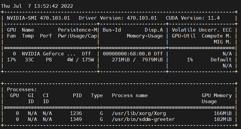

# Docker for Tensorflow2.x and Cuda Toolkit
+ 此篇主要說明如何在 Linux 上建置 Tensorflow2 以及 CUDA 等 Docker 環境

**Last update: 2024/03/13**

## 1. 安裝 docker for tensorflow-gpu
```
sudo docker pull tensorflow/tensorflow: 2.6.0-gpu
```
可以從此網址尋找版本
[Tensorflow Docker Images]([https://ubuntu.com/download/amd](https://hub.docker.com/r/tensorflow/tensorflow/tags?page=4))

## 2.	安裝 docker for Cuda toolkit
```
sudo apt-get install -y nvidia-docker2
sudo systemctl restart docker
sudo docker run --rm --gpus all nvidia/cuda: 11.4.0-base-ubuntu18.04 nvidia-smi
```

[CUDA 版本可以從此搜尋並下載](https://gitlab.com/nvidia/container-images/cuda/blob/master/doc/supported-tags.md)

成功安裝後會出現



## 3.	啟動tensorflow with cuda
```
sudo docker run --gpus all -it --rm tensorflow/tensorflow: 2.6.0-gpu
```

## 4.	確認是否有運行到gpu

可以使用以下兩條 python 指令來驗證
```
python -c "import tensorflow as tf; print(tf.reduce_sum(tf.random.normal([1000, 1000])))"
或是
python -c "import tensorflow as tf; print(tf.config.list_physical_devices('GPU'))"
```

## 5.	啟動並掛載當前工作資料夾到Docker中
```
docker run --gpus all --rm -v <work_directory>:/home -it tensorflow:2.6.0-gpu /bin/bash
```

## 6.	安裝額外 dependencies
```
pip install easydict
pip install pillow
pip install matplotlib
pip install scipy
pip install tqdm
```
